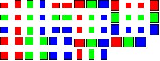

# Chad's Wall Maker
Quick python script to create texture files for walls for in Terraria.

### Prerequisites:
[Python 2.* 32-bit/x86](https://www.python.org/downloads/) - The language in which this was written  
[Python Imaging Library](https://pypi.org/project/Pillow/#files) - Python module used for image manipulation (make sure to get the version build for the python version you installed, and has the same amount of bits (32/64) as the python installation) (If you're on Windows, scroll down all the way for the Windows installers)

### First run:
Windows:  
1) Place "Chads Wall Maker.py" and "Chads Wall Maker.cmd" in an empty folder  
2) Double click "Chads Wall Maker.cmd" (the one with the gear icon)  
   At this point your anti-virus software might start screaming, this is because .cmd files are files which directly ask Windows to do something (which can indeed be used for evil, but in this case we are just asking Windows to run the Python file (feel free to open the .cmd file with a text editor to confirm this))  
   A console window should pop up with some text, and an input directory should be generated.  
3) Run the .cmd file again, and you should get some more information.  

Unix/Mac/Other:  
1) Place "Chads Wall Maker.py" in an empty folder.  
2) Open a terminal window and `cd` to this folder.  
3) `python ./"Chads Wall Maker.py"`  
   The First run should generate an input directory (assuming write privileges)  
4) Run the file again and you should get some more info.  

### Usage (after first run):
Windows:  
1) Put your wall image files in the input folder. (see input image format)  
2) Double click "Chads Wall Maker.cmd"  
3) Open output folder.  
4) ???  
5) Profit!  

Unix/Mac/Other:
1) Put your wall image files in the input folder. (see input image format)  
2) Open a terminal windows and `cd` into the directory containing "Chads Wall Maker.py"  
3) `python "Chads Wall Maker.py`  
4) Open output directory  
5) ???  
6) Profit!  

### Example:
Image file in "inWalls" directory: (also a template)  
  
Run the script.  
Image file in "outWalls" directory:  
  

### FAQ / HELP!
"Can it process multiple images in 1 run?"  
- Yes, just put them all in the "inWalls" directory.  

"Does it delete the original/input image after use?"  
- No.  

"How do I use this?"  
- Copy and open "inWalls/Example.png", the Red square will be texture 1, Green: texture 2, Blue: texture 3. Then save the file as "wallname.png" in "inWalls". Now run the script (see usage), and your wallified image should be found in "outWalls" under the same name.  

Errors:  
"'python' is not recognized as an internal or command...":  
  Windows cannot locate Python, make sure during the Python install to select "add to path", or open "Chads Wall Maker.cmd" in a text editor and replace `python` with wherever you installed Python/python.exe  

"ImportError: No module named PIL":  
  Python cannot find the Imaging library, did you install it in the correct place, and/or is it the correct python version/bits?  

"No walls/images found!":  
  Either the images are too small, or they cannot be found in "inWalls".  

"Error while saving, file already exists!" / "Attempted overwrites" / "0 walls successfully converted and saved!":  
  By default this script won't overwrite already existing files, if you wish for it to do, open "Chads Wall Maker.py" in a text editor, and change `doNOToverwrite = True` to `doNOToverwrite = False` and hit save.  

Other:  
None that I can think of, if you have questions unanswered or other, feel free to ask.  

### Credit / Copyright:
360chadscope: For making an awesome [Terraria mod](https://forums.terraria.org/index.php?threads/chads-furniture-and-more-mod.57562/), and for the suggestion/idea.  
sjaak31367: Code  

Written on 2018-24 and 2018-10-25 by sjaak31367.  
Feel free to use for personal/non-commercial/commercial/other uses, and or to copy/modify/change/redistribute/do with it as you please, as long as do not change the copyright of the script file.  
Credit is not needed, but would be nice. :) 

I won't give any warranty for what you do or don't with script/software, I can tell you it _SHOULD_ work without pooping all over your floor, but if it does do that somehow:  
1) I (the writers) shall not be held liable.  
2) Please do tell me as I'd be interested to see how that managed to happen.  

### Todo:
Maybe make a standalone version, and/or improve the code, but so far if it works, I don't see an incredible need to.   
